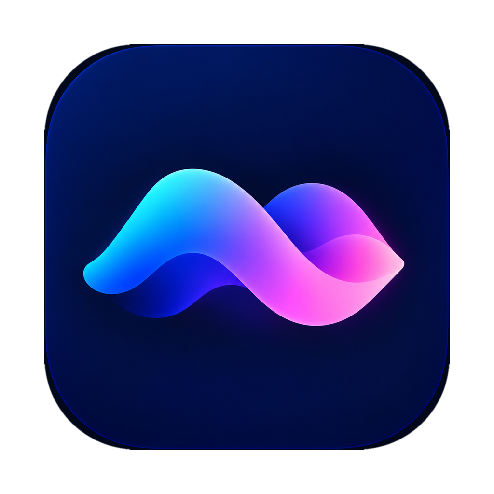
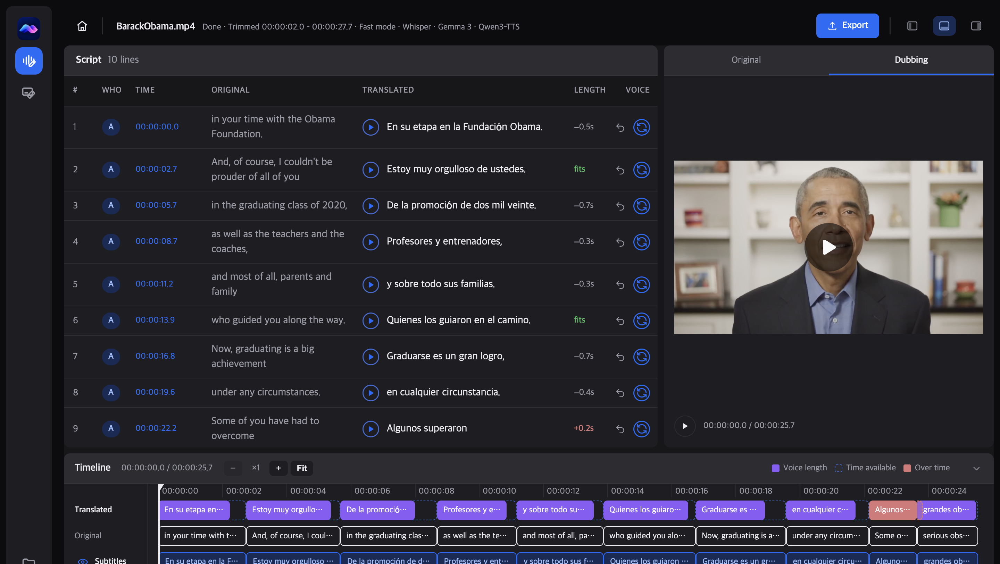
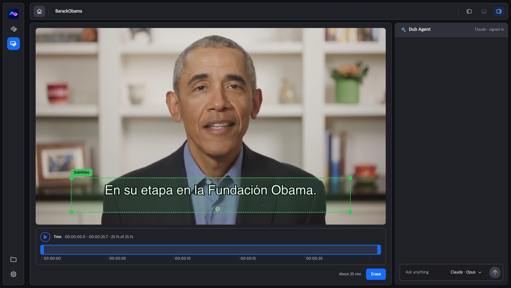

<p align="center">
  
</p>

<h1 align="center">PersoDub</h1>

<p align="center"><strong>Open-source AI video dubbing. PersoDub is the ElevenLabs, HeyGen and Rask AI alternative that runs on your own computer.</strong></p>

<p align="center">
  <a href="#get-started">Download</a> ·
  <a href="#hear-the-difference">Hear the difference</a> ·
  <a href="docs/usage.md">How to use it</a> ·
  <a href="docs/faq.md">FAQ</a> ·
  <a href="https://github.com/stronghamjji/PersoDub/issues">Report a problem</a>
</p>

<p align="center">
  <a href="LICENSE"></a>
  <a href="docs/requirements.md"></a>
  <a href="https://github.com/stronghamjji/PersoDub/releases"></a>
  <a href="docs/privacy.md"></a>
</p>

<p align="center">
  <a href="https://github.com/stronghamjji/PersoDub/releases/latest/download/PersoDub-mac.dmg"></a>
  <a href="https://github.com/stronghamjji/PersoDub/releases/latest/download/PersoDub-Setup.exe"></a>
</p>

<p align="center">
  
</p>

<p align="center">Drop in a video. Clone the voice. Dub it. Post it to Shorts, TikTok or Reels.</p>

---

## What it does

<table>
<tr>
<td width="33%" valign="top">


### Dub

One video in, one dubbed video out, in each speaker's own voice. 10 languages on your computer, 77 with Perso's cloud.

</td>
<td width="33%" valign="top">


### Fix every line

Edit a line by hand, or tell the **Dub Agent** "make line 9 fit". Only that line is remade.

</td>
<td width="33%" valign="top">



### Erase burned-in subtitles

Box the subtitles, press **Erase**, and dub the clean video.

</td>
</tr>
</table>

## Hear the difference

Same clip, English → Korean, each tool cloning the speaker's voice.

<table>
<tr>
<td width="50%">

### Original (English)

---

https://github.com/user-attachments/assets/39589651-83fe-4673-91b4-fa078f0e523e

</td>
<td width="50%">

### PersoDub (Ours)

---

https://github.com/user-attachments/assets/09f6dbd8-70f1-487f-bf8d-2d9fa5cb6433

</td>
</tr>
</table>

<table>
<tr>
<td width="25%" align="center"><b><a href="https://github.com/Huanshere/VideoLingo">VideoLingo</a></b></td>
<td width="25%" align="center"><b><a href="https://github.com/krillinai/KrillinAI">KrillinAI</a></b></td>
<td width="25%" align="center"><b><a href="https://github.com/abus-aikorea/voice-pro">Voice-Pro</a></b></td>
<td width="25%" align="center"><b><a href="https://github.com/debpalash/VoiceStudio">VoiceStudio</a></b></td>
</tr>
<tr>
<td width="25%">

https://github.com/user-attachments/assets/1045c7f6-eb6e-4df5-aee9-16cd231e5d53

</td>
<td width="25%">

https://github.com/user-attachments/assets/7cd0456a-0f0f-4be9-88d8-5ab5dece2f5a

</td>
<td width="25%">

https://github.com/user-attachments/assets/1d84b466-57b4-43ea-8760-35eae9a198d3

</td>
<td width="25%">

https://github.com/user-attachments/assets/fac60bb8-a18b-47ec-a9c8-c1a4509fa4fb

</td>
</tr>
</table>

Listen for pacing: PersoDub never speeds the audio up. The source files live in [docs/demo](docs/demo).

## Get started

1. Download for [macOS](https://github.com/stronghamjji/PersoDub/releases/latest/download/PersoDub-mac.dmg) or [Windows](https://github.com/stronghamjji/PersoDub/releases/latest/download/PersoDub-Setup.exe).
2. Drop in a video, or paste a link.
3. Pick a language and press **Start dubbing**.

First setup is under 1 GB. The AI engine downloads on your first dub (2–9 GB).

<details>
<summary>Install notes</summary>

**macOS** — Open the `.dmg` and drag **PersoDub** into Applications. It is signed and notarized, so it opens with a normal double-click, and it checks for updates on launch.

**Windows** — Run the `.exe`. It installs for your user account only. It is not code-signed yet, so SmartScreen shows "Windows protected your PC" the first time: click **More info**, then **Run anyway**. [Details](INSTALL.md#windows).

A screen-by-screen walkthrough is in [docs/usage.md](docs/usage.md).

</details>

### Install with your AI assistant

Paste this into Claude Code, Codex or any coding agent.

```text
Install PersoDub on this computer and check that it works.
Repository: https://github.com/stronghamjji/PersoDub

1. Check my OS, CPU, memory, free disk and GPU. PersoDub needs an Apple Silicon Mac
   or 64-bit Windows 10/11, 16 GB of memory and 30 GB of free disk.
   If this computer falls short, say so and stop.
2. Install the latest release for my OS:
   https://github.com/stronghamjji/PersoDub/releases/latest
   On Windows, SmartScreen warns (not code-signed yet): More info, then Run anyway.
3. Open PersoDub and wait for the first setup (under 1 GB).
4. Ask me if I want more accurate transcription with a free Perso key. If yes, open
   https://perso.ai/dubbing?utm_source=desktop_app_github&utm_medium=desktop-app&utm_campaign=desktop_app&utm_content=install_prompt
   then open PersoDub's Settings so I can paste the key in myself. Never ask to see it.
5. Dub one video under a minute with me. Tell me the download size (2-9 GB) first.
6. Report the version, where projects are saved, and how to reopen the app.
Finish the setup, not just a plan. Tell me any step you could not do.
```

## Why PersoDub

- **Your footage stays yours.** Local by default: no account, no API key, no uploads.
- **No time-stretching.** Other tools speed the audio up. PersoDub never does.
- **Voice cloning, not narration.** Each speaker still sounds like themselves.
- **Everything else is kept.** Music and effects stay. The translated `.srt` comes with the video.

## Details

| | |
|---|---|
| **Requirements** | Apple Silicon Mac or 64-bit Windows · 16 GB memory · 30 GB disk. [Full table](docs/requirements.md) |
| **Languages** | 10 on your computer, 77 with Perso's cloud. [Full list](docs/languages.md) |
| **Better quality** | A free Perso key for transcription, a Gemini key for translation. [Configuration](docs/configuration.md) |
| **Privacy** | By default your video never leaves this computer. [What is sent](docs/privacy.md) |
| **How it works** | Demucs, Whisper, CAM++, a local LLM, Qwen3-TTS. [Pipeline](docs/development.md) · [Comparison](docs/comparison.md) · [Roadmap](docs/roadmap.md) |
| **Build from source** | [INSTALL.md](INSTALL.md) · [Development](docs/development.md) · [Contributing and security](docs/contributing.md) |

## License and responsible use

[AGPL-3.0](LICENSE). Use it, change it, sell it; if you distribute a changed version or run one as a service, the changed source is shared under the same license. Releases up to 0.6.5 were published under Apache 2.0 and stay that way.

Clone only voices you have the right to use. [Responsible use](docs/responsible-use.md) · [Acknowledgments](docs/acknowledgments.md) · [NOTICE](NOTICE)

This repository, [github.com/stronghamjji/PersoDub](https://github.com/stronghamjji/PersoDub), is the only official source. Downloads appear only on its [Releases page](https://github.com/stronghamjji/PersoDub/releases).
