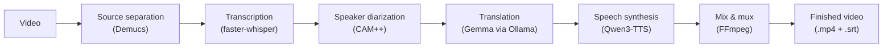

# PersoDub

**PersoDub - 100% Locally on Your Desktop: Dub Videos in Your Own Voice**

PersoDub re-voices a video into another language in the speaker's own cloned voice,
entirely on your desktop. No cloud, no account, no uploads: your footage never leaves
your computer.

  
  

<b>macOS:</b> signed and notarized, opens with a double-click. &middot; <b>Windows (beta):</b> not signed yet, so SmartScreen asks first - click <b>More info</b>, then <b>Run anyway</b>. <a href="INSTALL.md#windows-beta">Details</a>.

> [!WARNING]
> **The only official source for PersoDub is
> [github.com/stronghamjji/PersoDub](https://github.com/stronghamjji/PersoDub).**
>
> Downloads, when published, appear only on
> [this repository's Releases page](https://github.com/stronghamjji/PersoDub/releases).
> Copies of this project hosted under any other account are not maintained by us --
> please do not run software you obtained from them.

---

## What is PersoDub?

**Dub a video into another language in the original speaker's own voice — entirely on your desktop.**

PersoDub is a desktop app that takes one video file and returns a dubbed version of it.
It separates speech from background audio, transcribes it, works out who spoke when,
translates each line, clones each speaker's voice, and mixes the result back over the
original soundtrack. With the default settings, every one of those steps runs locally.

> **Every line is yours.** Edit any translation by hand — or ask the **Dub Agent**.
> Say *"retranslate line 4 so it fits"* and it retranslates just that line and remakes
> its voice. The agent is Claude Code or Codex running on your own computer; your video
> is never sent anywhere for it.

  

> **PersoDub is under active development.** It is usable today.
> macOS on Apple Silicon and Windows (beta) are supported; Linux is planned.
> Interfaces and defaults may change. Please report problems through
> [Issues](https://github.com/stronghamjji/PersoDub/issues).

## Hear the difference

The same clip, dubbed English → Korean by each tool with the speaker's own voice
cloned.

<table>
<tr>
<td width="50%">

### Original (English)

---

https://github.com/user-attachments/assets/39589651-83fe-4673-91b4-fa078f0e523e

</td>
<td width="50%">

### PersoDub

---

https://github.com/user-attachments/assets/09f6dbd8-70f1-487f-bf8d-2d9fa5cb6433

</td>
</tr>
</table>

<table>
<tr>
<td width="25%" align="center"><b><a href="https://github.com/Huanshere/VideoLingo">VideoLingo</a></b></td>
<td width="25%" align="center"><b><a href="https://github.com/krillinai/KrillinAI">KrillinAI</a></b></td>
<td width="25%" align="center"><b><a href="https://github.com/abus-aikorea/voice-pro">Voice-Pro</a></b></td>
<td width="25%" align="center"><b><a href="https://github.com/debpalash/VoiceStudio">VoiceStudio</a></b></td>
</tr>
<tr>
<td width="25%">

https://github.com/user-attachments/assets/1045c7f6-eb6e-4df5-aee9-16cd231e5d53

</td>
<td width="25%">

https://github.com/user-attachments/assets/7cd0456a-0f0f-4be9-88d8-5ab5dece2f5a

</td>
<td width="25%">

https://github.com/user-attachments/assets/1d84b466-57b4-43ea-8760-35eae9a198d3

</td>
<td width="25%">

https://github.com/user-attachments/assets/fac60bb8-a18b-47ec-a9c8-c1a4509fa4fb

</td>
</tr>
</table>

Listen for pacing: PersoDub's lines land inside their original time slots without
speeding the audio up — the difference explained in [Why PersoDub](#why-persodub).
The source files live in [docs/demo](docs/demo).

---

## Why PersoDub

- **Your footage stays yours.** Processing is 100% local by default — no account, no
  API key, no uploads. Cloud engines are opt-in only. See
  [Data and privacy](#data-and-privacy).
- **No time-stretching.** Most dubbing tools speed the audio up when a translation runs
  longer than the original line — that's why dubs often sound rushed. PersoDub never
  resamples the dubbed audio; the constraint is enforced in code, not convention.
  Details in [Where PersoDub fits](docs/comparison.md).
- **Voice cloning, not narration.** Each speaker's timbre is cloned from the source
  audio, so the dub sounds like that person speaking another language, not a generic
  synthetic narrator.
- **Everything else is preserved.** Music and effects stay untouched; only speech is
  replaced. Translated subtitles (`.srt`) are exported alongside the dubbed video.

## Requirements

| | |
|---|---|
| **Hardware** | Apple Silicon Mac (M1 or newer), or a 64-bit PC. Intel Macs are not supported. |
| **OS** | macOS 11 (Big Sur) or later, or Windows 10 (21H2) / Windows 11. Linux is [planned](docs/roadmap.md). |
| **Graphics (Windows)** | An NVIDIA GPU is strongly recommended — AMD and Intel graphics are not accelerated. Everything works without one, just slower; see [Speed without a GPU](docs/faq.md#speed-without-a-gpu). |
| **Memory** | 24 GB recommended, 16 GB minimum |
| **Disk** | 30 GB free on macOS, 45 GB on Windows. The first launch downloads the AI models and runtimes once — roughly 19 GB on macOS, 34 GB on Windows. |
| **Network** | Required for the first-run download. Afterwards PersoDub runs offline unless you enable a cloud engine. |

## Installation

Both platforms install the same way: **go to the
[latest release](https://github.com/stronghamjji/PersoDub/releases/latest)** and
download the file for your computer.

| Your computer | File to download |
|---|---|
| Mac with Apple Silicon (M1 or newer) | `PersoDub-<version>-arm64.dmg` |
| Windows 10 (21H2+) / 11, 64-bit | `PersoDub-Setup-<version>.exe` |

**macOS** — Open the `.dmg` and drag **PersoDub** into Applications. It's signed and
notarized, so it opens with a normal double-click, and it checks for updates on launch.
Building from source: [INSTALL.md](INSTALL.md#macos--install-from-source-for-developers).

**Windows (beta)** — Run `PersoDub-Setup-<version>.exe`. It installs for your user
account only (no admin rights needed). The build isn't code-signed yet, so SmartScreen
shows "Windows protected your PC" the first time — click **More info**, then
**Run anyway**.

On either platform, the first launch downloads the AI models and runtimes — roughly
19 GB on macOS, about 34 GB on Windows (see [Requirements](#requirements)). It happens
once; [docs/usage.md](docs/usage.md#first-launch) shows what that screen looks like.

## Usage

1. Launch **PersoDub**. On first run it downloads its models (see
   [Requirements](#requirements)); after that it opens on its first screen, which asks
   one thing: which video?
2. Drop your video on the drop zone, click **Choose a file**, or paste a video link —
   MP4 or MOV, up to 2 GB.
3. The **New project** dialog opens. Trim the part you want dubbed, pick the original
   and target languages (10 are supported — see
   [Supported languages](#supported-languages)), and open **Advanced options** if you
   want to change an engine.
4. Click **Start dubbing**. The running screen ticks off the four stages, and counts
   the lines as it voices them.
5. When it finishes, the job opens on the finished screen: the script line by line
   beside the player, a timeline underneath, and **Export** in the top bar for the
   dubbed video and the translated `.srt`.

Each line has a play button to hear it alone and a waveform button to remake its voice
after you edit the words; **Original** and **Dubbed** swap which file the player shows,
and the **Dub Agent** strip along the bottom can fix lines for you (see
[What is PersoDub?](#what-is-persodub)). Past jobs are under **Projects**, the folder
icon on the left.

Engine choices (transcription, translation, quality) live under the **Advanced
options** toggle, collapsed by default — see [Configuration](#configuration) for what
each default is and how to switch a step to a cloud engine.

A screen-by-screen walkthrough, with screenshots of every option, is in
**[docs/usage.md](docs/usage.md)**.

## Supported languages

English · Korean · Chinese · Japanese · French · German · Italian · Portuguese ·
Russian · Spanish

## Configuration

PersoDub works with no configuration: by default, transcription and speaker-labeling
run on local Whisper + CAM++, and translation runs on local Gemma via Ollama.

Want better quality? Add an API key in the app's **Settings** screen
([screenshot](docs/usage.md#settings)) to switch that one step to a cloud engine:

| Add this key | Improves | Get it from |
|---|---|---|
| **Perso API key** | Transcription and speaker-labeling accuracy | [Perso Dubbing](https://perso.ai/dubbing?utm_source=desktop_app_github&utm_medium=desktop-app&utm_campaign=desktop_app&utm_content=readme) — includes a free allowance |
| **Google Gemini key** | Translation quality | [Google AI Studio](https://aistudio.google.com/app/apikey) |

Keys are stored on your machine and take effect from your next dub — no restart needed.

> **Note:** PersoDub is an independent open-source project. It integrates with Perso and
> Google Gemini as optional third-party services and is not affiliated with or endorsed
> by either.

## Data and privacy

**With the default engines, nothing leaves your machine.** Enabling an optional cloud
engine sends only what that engine needs — a Perso key uploads the video for
transcription, a Gemini key sends transcript text only, never the video or audio.
PersoDub also reports a few anonymous usage counts (never your video, audio, or file
content), which you can turn off in **Settings → Privacy**.

Full breakdown — exactly what's sent, what's tracked, and how to opt out of
everything — is in **[docs/privacy.md](docs/privacy.md)**.

### The Dub Agent and your files

The Dub Agent is an assistant **already installed on your computer** — Claude Code or
Codex — that PersoDub asks to edit the script. PersoDub has no assistant of its own,
and your video is never sent anywhere for this. How much each one can see is different:

- **Claude Code** can only use PersoDub's script tools. It cannot read your files or
  run shell commands. **The safer choice.**
- **Codex** can also **read any file you can read** on this computer, and whatever it
  reads goes to OpenAI as part of the chat (including your own `AGENTS.md`, if you keep
  one). It cannot change your files or use the network. If that matters to you, use
  Claude Code.

The conversation continues from one job to the next, kept by the assistant's own tool
on your machine — closing PersoDub doesn't end it. Either one answers on your account
with that vendor and is billed there.

## Responsible use

PersoDub clones the voices of real people. Please use it accordingly.

- Only clone a voice that is yours, or one you have explicit permission to use.
- Disclose AI-dubbed audio as synthetic wherever you publish it.
- Do not use PersoDub to impersonate anyone, or to misrepresent what a person said.
- You are responsible for holding the rights to your source material and for complying
  with the laws and regulations that apply where you are.

Dubbing from a pasted link fetches the video locally via yt-dlp — see
[docs/privacy.md](docs/privacy.md#dubbing-from-a-link) for how that works and your
responsibilities there.

## How it works

The app itself is a thin orchestrator. Each heavy stage runs as an isolated
subprocess with its own Python environment, so a failure in one stage cannot take
down the others. Architecture details are in [docs/development.md](docs/development.md).

## Learn more

- [Where PersoDub fits](docs/comparison.md) — how it compares to other open-source dubbing tools
- [Known limitations & roadmap](docs/roadmap.md)
- [Troubleshooting & FAQ](docs/faq.md)
- [Data and privacy, in detail](docs/privacy.md)

## Development

Setup, architecture, and how to run the test suite are documented in
**[docs/development.md](docs/development.md)**.

The backend targets Python 3.11 and is not yet compatible with 3.13 or later.

## Contributing

Issues and pull requests are welcome. Please open an issue describing the problem or
proposal before starting substantial work, so effort is not duplicated. Bug reports are
most useful when they include your operating system version — macOS version and your
Mac's chip, or your Windows version and whether the machine has an NVIDIA GPU — and the
job log from the failing run.

## Security

Please do not report security issues in public issues. Use GitHub's
[private vulnerability reporting](https://github.com/stronghamjji/PersoDub/security/advisories/new)
so the problem can be addressed before disclosure.

PersoDub stores your API keys in a file on your machine. Treat that file, and any log or
screenshot you share, the way you would treat the keys themselves.

## License

Apache License 2.0 — see [LICENSE](LICENSE).

[NOTICE](NOTICE) lists the third-party components and their licenses. This repository
redistributes the CAM++ speaker model and a small amount of ported Demucs source
(MIT, © Meta Platforms, Inc. and affiliates). Everything else is fetched from its own
upstream source during installation.

## Acknowledgments

PersoDub stands on these open-source projects.

| Project | Role |
|---|---|
| [Qwen3-TTS](https://github.com/QwenLM/Qwen3-TTS) | Voice-cloning speech synthesis |
| [Demucs](https://github.com/adefossez/demucs) | Source separation — splits speech from background audio |
| [faster-whisper](https://github.com/SYSTRAN/faster-whisper) | Speech recognition |
| [CAM++ (3D-Speaker)](https://github.com/modelscope/3D-Speaker) | Speaker diarization |
| [Ollama](https://github.com/ollama/ollama) + [Gemma](https://github.com/google-deepmind/gemma) | Local translation model and runtime |
| [FFmpeg](https://github.com/FFmpeg/FFmpeg) | Video and audio processing |
| [Electron](https://github.com/electron/electron) | Desktop application framework |

---

Ever winced at a dub crammed into its slot at 1.3× speed? That is the problem this exists to fix.

⭐ **Star the repo** so the next person looking for a way out finds it.

