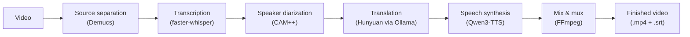

# Acknowledgments

PersoDub stands on these open-source projects.

| Project | Role |
|---|---|
| [Qwen3-TTS](https://github.com/QwenLM/Qwen3-TTS) | Voice-cloning speech synthesis |
| [Demucs](https://github.com/adefossez/demucs) | Source separation — splits speech from background audio |
| [faster-whisper](https://github.com/SYSTRAN/faster-whisper) | Speech recognition |
| [CAM++ (3D-Speaker)](https://github.com/modelscope/3D-Speaker) | Speaker diarization |
| [Ollama](https://github.com/ollama/ollama) + [Hunyuan](https://github.com/Tencent-Hunyuan) | Local translation model and runtime |
| [FFmpeg](https://github.com/FFmpeg/FFmpeg) | Video and audio processing |
| [video-subtitle-remover](https://github.com/YaoFANGUK/video-subtitle-remover) | Erasing subtitles burned into the picture |
| [yt-dlp](https://github.com/yt-dlp/yt-dlp) | Fetching a video from a pasted link |
| [Electron](https://github.com/electron/electron) | Desktop application framework |

The full list of third-party components and their licenses is in [NOTICE](../NOTICE).

## How the pipeline fits together

The app itself is a thin orchestrator. Each heavy stage runs as an isolated subprocess
with its own Python environment, so a failure in one stage cannot take down the others.
Architecture details are in [Development](development.md).
