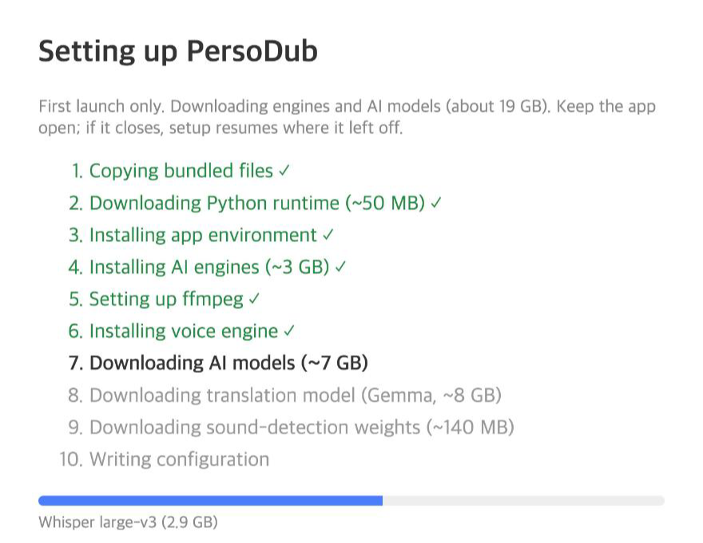
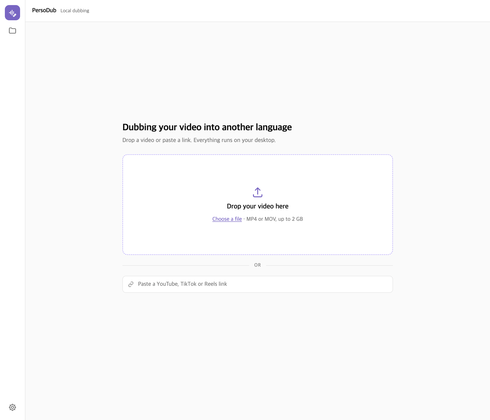
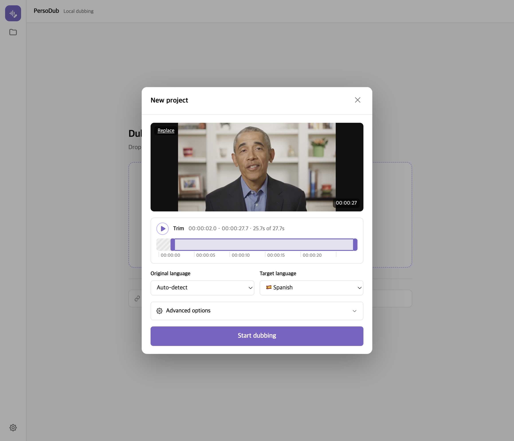
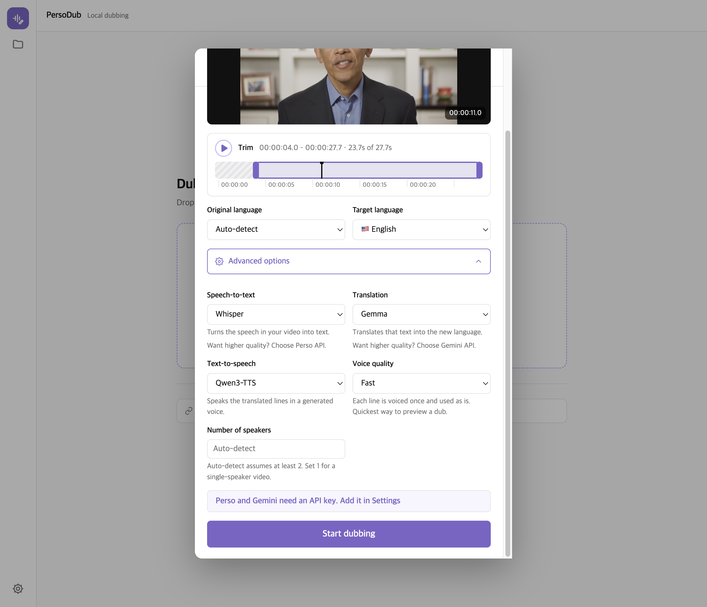
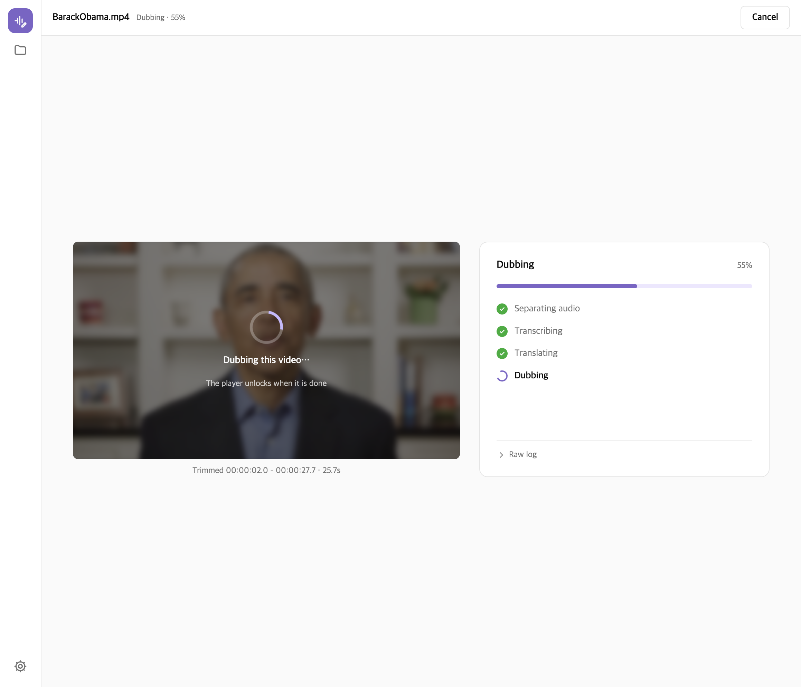
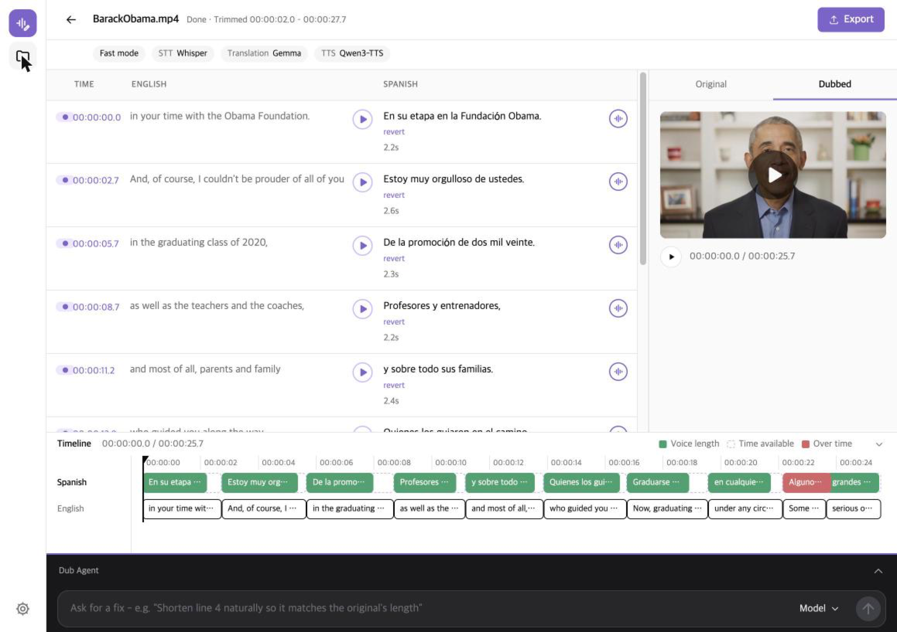
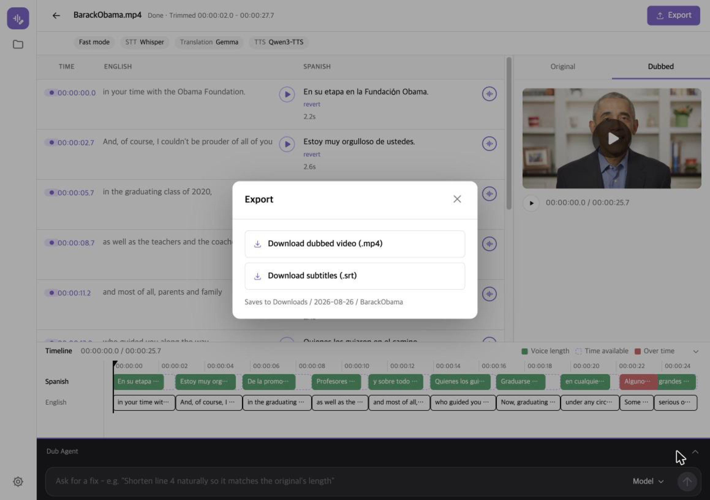
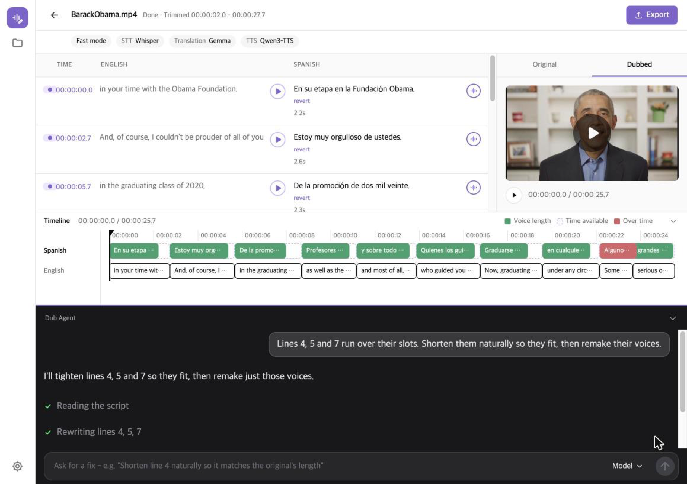
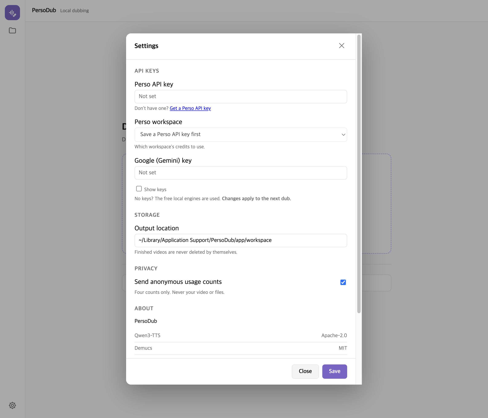

# Using PersoDub

A screen-by-screen walkthrough of the app. To install it, see the
[Installation section of the README](../README.md#installation).

## First launch

The first time PersoDub opens, it downloads its engines and AI models — roughly 19 GB
in total. This happens once. The window lists the steps and ticks them off as they
finish; if the app is closed partway through, setup resumes where it left off.

Nothing else is needed while this runs. When it completes, the app opens on its first
screen.

## The first screen

One question only: which video?

Drop a file onto the drop zone, click **Choose a file** to browse, or paste a video
link. MP4 and MOV are accepted, up to 2 GB. A link is fetched to your machine first;
see [Dubbing from a link](privacy.md#dubbing-from-a-link).

## New project

The moment a video (or a link) is ready, the **New project** dialog opens. Everything
the first screen no longer asks for is in here.

**Trim** — the bar under the video picks the part to dub. Drag the two handles, or use
the play button to hear the selection; the readout shows the selection in
`hh:mm:ss.d` and how much of the video is left. Leave it alone to dub the whole thing.
A trimmed video is re-encoded before dubbing starts, which takes a moment but cuts
exactly where you asked — copying instead would land on the nearest keyframe, seconds
away.

**Original language** — leave on *Auto-detect* unless detection gets it wrong.

**Target language** — the language to dub into. Ten are supported: English, Korean,
Chinese, Japanese, French, German, Italian, Portuguese, Russian and Spanish.

### Advanced options

Collapsed by default: the defaults are the fully local, free path and are a good
starting point.

| Field | Default | Notes |
|---|---|---|
| **Speech-to-text** | Whisper | Turns the speech in your video into text. The alternative, *Perso API*, needs a Perso API key — see [Settings](#settings). |
| **Translation** | Gemma | Translates the transcribed text. The alternative, *Gemini API*, needs a Google Gemini key. |
| **Text-to-speech** | Qwen3-TTS | Speaks the translated lines in the cloned voice. |
| **Voice quality** | Fast | *Fast* voices each line once. *High quality* voices it four times and keeps the best take — noticeably better, and the voice stage takes about 4× longer. |
| **Number of speakers** | Auto-detect | Auto-detect assumes at least two speakers. Set it to 1 for a single-speaker video. |

An engine that needs a key it cannot find is marked as unavailable rather than
silently failing.

## While it runs

**Start dubbing** closes the dialog and opens the running screen: your video playing
blurred behind the card, and the four stages ticking off beside it. The voice stage
counts the lines as it goes. **Cancel** in the top bar is the way out; the job stops at
its next stage boundary.

There is deliberately no "about N minutes left": the four stages take wildly different
times on different machines, so any estimate would be a promise the app breaks.

## The finished screen

When the job finishes, it opens on the screen the app is really about — the script.

- **The table** is one row per line: its number, who spoke it, its time slot, the
  original line, the translated line, and how long the voice actually runs.
- **The play button** beside a line plays just that line.
- **The waveform button** remakes that line's voice — use it after changing the words.
  A line you have edited offers **revert**, which puts the translation back.
- **Original** and **Dubbed** swap which file the player shows.
- **The timeline** underneath shows each line's slot against the voice made for it:
  *Voice length*, *Time available*, and *Over time* for a voice that does not fit.
- **Export** in the top bar hands back the dubbed video, the translated `.srt`, and —
  for a job that started from a link — the original video.
- The dividers between the table, the player, the timeline and the agent strip can be
  dragged, and the sizes are remembered.

The **Speaker** column is filled in only when PersoDub worked out who spoke when. A job
started from subtitles you supplied (an option of the HTTP API, not of the app's own
screens) skips that step, so the column stays empty for it.

### Export

**Export** in the top bar opens a dialog with a link per file.

The line under the links says where a click will put the file: the app saves it without
asking, into `Downloads` / the day the job ran / the project's name. Once a file has
landed, its row is ticked and says **Saved**, and the line says which file went where.

## The Dub Agent

The strip along the bottom of the finished screen is the Dub Agent. Ask for a fix in
plain words — "shorten line 4 so it fits, then remake its voice" — and it edits the
script and remakes voices through PersoDub's own tools, showing each step as it goes.

Pick which assistant answers from the button on the right of the strip. It runs a CLI
that is **already installed on your computer** — Claude Code or Codex — and is billed to
your own account with that vendor.

**Sign in first, in Terminal.** The Dub Agent uses whichever CLI you have already
signed into on your own machine — PersoDub does not log in for you. Before your first
message, open Terminal and run `claude` (and follow the browser sign-in) for Claude
Code, or `codex login` for Codex. If a CLI is not signed in, its first answer fails
with a sign-in error; sign in in Terminal and try again.

The strip is locked while a dub is running: a turn started mid-dub would rewrite a
script the pipeline is still reading.

What each assistant can reach on your machine — and the fact that **Codex can read
files on this computer even in its read-only sandbox** — is spelled out in
[The Dub Agent and your files](../README.md#the-dub-agent-and-your-files).

## Projects

The folder icon on the left opens **Projects**: every job this app knows about, newest
first, with a coloured dot for its state. Click one to reopen it — a finished job comes
back on the finished screen, a failed one on its failure card, with the reason and a
button to try the same video again. **Delete** removes that job's folder — the dubbed
video, the script and the voices — and cannot be undone.

The list is built from a `job.json` written next to each job's files, so it survives
quitting the app. A job that was still running when the app quit comes back as
interrupted: nothing was left to finish it.

## Settings

Open Settings with the gear icon at the bottom left of the window.

**API keys** — both are optional. Without them, PersoDub uses its free local engines
(Whisper for transcription, Gemma for translation). Keys are saved into the app's own
config file on your machine. Changes apply to the next dub - no restart needed.

- **Perso API key** — enables the paid transcription and diarization path. Once a key is
  saved, **Perso workspace** lets you pick which workspace the jobs run in, and whose
  credits they use.
- **Google (Gemini) key** — enables the paid translation path.

**Output location** — shows the folder your dubs are saved into. Read-only; finished
videos are never deleted by themselves.

**Privacy** — *Send anonymous usage counts* is four counts and nothing else, never your
video or files. Turn it off here.

**About** — the app version, and the licenses of the open-source components bundled with
it. The full text ships inside the app as `NOTICE`.

## Where the files go

See [Data and privacy](../README.md#data-and-privacy) in the README for what is written
to disk and what, if anything, leaves your machine.
